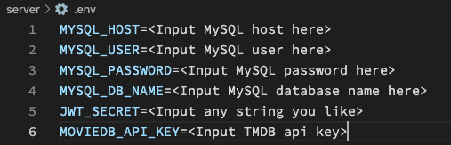

# Backend of Movie Afterthoughts

## Continuing from [Frontend](https://github.com/danny1233211/moviesAfterthoughtsFrontEnd "Front end") setup

Clone this repository. You will need node and npm installed globally on your machine.

Installation:

```bash
npm install
```

* Download MySQL from [MySQL](https://www.mysql.com/) 

* Set up MySQL on local machine and retrieve your MySQL host, user, password.

* Create a new database on MySQL and retrieve the database name.

* Sign up for an api key on [The Movie Database](https://developers.themoviedb.org/3/getting-started/introduction "TMDB").

* Create a ```.env``` file in the root directory.

* Input all information retrieved along with a jwt secret (can be any string) in ```.env```.

* Your ```.env``` should look something like the image below, with all the values inputted according. Make sure the variable names match.



To Start Backend:

```bash
npm run dev
```

## License

Distributed under the MIT License. See [LICENSE](https://github.com/danny1233211/moviesAfterthoughtsFrontEnd/blob/main/LICENSE.md) for more information.
